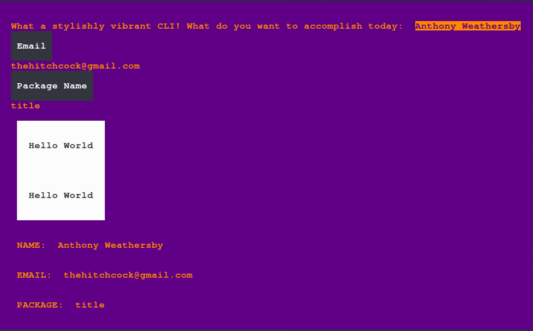

<div>
<h1 align="center">
</h1>

<h3 align="center">CLI Tools</h3>

<p align="center">
<sub>
<b>v0.0.4</b>
</sub>
</p>

<p align="center"></p>

<div>

Wax is a command-line-interface utility and rendering tool that can be used to perform several common tasks encountered when building CLI applications with NodeJS or Deno[*](#Deno%20Support).

### Current Features

- Parsing and objectifying input argument strings.

- Extracting information and writing to the package.json file.

- Rendering rich text UI's with HTML and CSS components using **wickurse**

### Deno Support

Though not yet implemented, the majority of Wax and its dependencies have been written in a way that would allow usage with Deno after some minor modification. The main task would be to setup a host for all CandleLibrary TypeScript files and update `import` statements to use absolute URLs for the respective library entry points. This has been, impart, accomplished with [cfw.Lantern](https://github.com/candlelibrary/lantern) and it's build-in CandleLibrary dispatch, so evolving this mechanism to work with Deno should be a fairly trivial task.
<div align="right">
<a href="./source/doc_fragments/readme_header.md#0">
</a>
</div>
</div>

<div>

## Install

### yarn

```bash
$ yarn add @candlelib/paraffin
```

### npm

```
$ npm install --save @candlelib/paraffin
```

<div align="right">
<a href="./source/doc_fragments/install.md#0">
</a>
</div>
</div>

<div>

## Rendering a CLI with Wickurse

Wickurse uses [cfw.Wick](https://github.com/candlelibrary/wick) to compile HTML and *.wick source files. Please refer to the [Wick documentation](https://github.com/candlelibrary/wick/documentation) for writing Wick components.

#### `wick-component.html`

```html
<div>
    <style>
        root {
            width : 100%;
            height: 100%;
            padding: 2; 
            background-color:indigo;
            color:darkorange;
            text-align: center
        }
    </style>
    What a stylishly vibrant CLI! <br/>
    What do you want to accomplish today: <input type=text></>
</div>
```

#### `my-app.js` or `my-app.ts`

```ts
import { wickurse } from "@candlelib/paraffin";

const 
    cursed_wick = await wickurse(),
    cli_view = await cursed_wick.cli("./wick-component.html");

await cli_view.start();
```

#### OUTPUT



<div align="right">
<a href="./source/doc_fragments/cli_ui.md#0">
</a>
</div>
</div>

<div>

## Extracting process arguments

```ts
// input: $ my-app --hello world -acb true naked_arg

import { getProcessArgs } from "@candlelib/paraffin";

const arg_obj = await getProcessArgs(
/** 
 * This object is an optional set of anticipated process arguments.
 * 
 *  - If the argument should be matched to a value, set the prop 
 *    value to `true`.
 * 
 *  - If the property should alias another property, provide the 
 *    name of the value to be aliased as a `string`.
 * 
 *  - If an argument is not defined, then it will appear in the 
 *    output object with a default value set to `true`.
 * 
 *  - If an argument name is not proceeded by a hyphen, then it 
 *    is considered a "naked" argument, and its output value is 
 *    set to `null`
 */ 
    {
        hello:true,
        boolean: true,
        b: "boolean"
    }
);

arg_obj["hello"]   // --> "hello world"
arg_obj.a           // --> true
arg_obj.c           // --> true
arg_obj.b           // --> undefined - This property was aliased to "boolean"
arg_obj.boolean     // --> "true"

```

<div align="right">
<a href="./source/doc_fragments/arg_usage.md#0">
</a>
</div>
</div>
</div>
